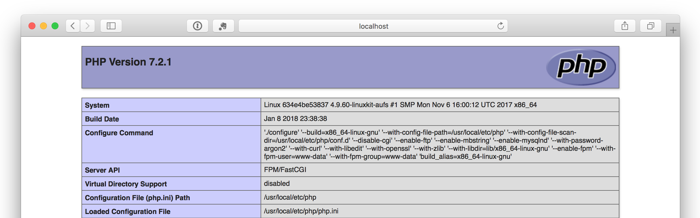
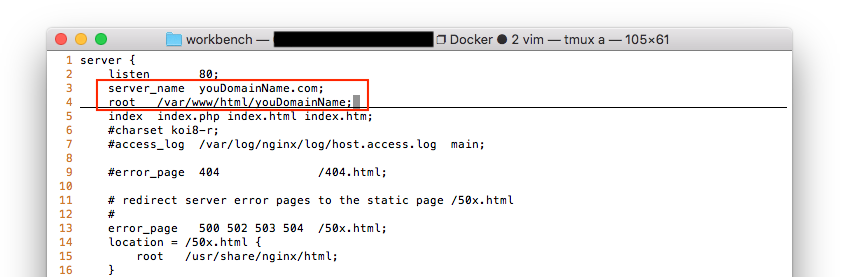

I myself, like the author ([copriwolf](https://github.com/copriwolf/docker-lnmp-with-mutli-php-versions)), are all using the old PHP version because of my work, so I added 5.4 and 7.1 to the author's content.


## Feature
1. Multiple PHP version can be one-time deployment.
2. All Configuration/Log files are stored in the host.
3. MySQL Data are stored in the host.

## Requirement

- Git
- Docker ([Install](https://docs.docker.com/engine/installation/))
- Docker-Compose([Install](https://docs.docker.com/compose/install/))

## Deploy

1. Clone Project:
```bash
$ git clone https://github.com/ajosak/Docker_multi_php_versions.git new_folder_name
```

2. Go into the project & Start docker compose:
```bash
$ cd new_folder_name
$ docker-compose up
```

3. Check the URL `localhost` in you browser, and you will catch the phpinfo with 7.2:



## Preview other php version website?
1. You can add these `hosts` in your system.
> hosts file location: Linux & Mac in `/etc/hosts`, Windows in `C:\Windows\System32\drivers\etc` (default)

```bash
127.0.0.1 www.site1.com
127.0.0.1 www.site2.com
127.0.0.1 www.site3.com
```

2. Then go to your browser and type `www.site3.com` or `www.site5.com`, you will catch the php5.6 & php5.3.

## Create a php53/php56/php72 website?
In fact I am using the Nginx conf file to control the version of PHP.
You can check the `.conf/nginx/conf.d/site1.conf`, and found I fill the `fpm72:9000` as the fastcgi_pass.
So you can use `fpm53:9000`/`fpm56:9000`/`fpm72:9000` to create a php53/php56/php72 website if you want.

Here is a example for creating a php53 site:

1. Copy a conf file from site3.conf
> If you want to create a `php56`/`php72` site? Refer to `site3.conf`/`site1.conf`

```bash
$ cp ./conf/nginx/conf.d/site3.conf ./conf/nginx/conf.d/youDomainName.conf
```

2. Edit the field `server_name`(Your WebSite Domain) & `root`(Your WebSite Root Directory) in conf file:


3. Create the Site Web Root Directory
```bash
$ mkdir ./site/youDomainName
```

4. Put the web files into the Directory
5. Restart the docker
```bash
$ docker-compose restart
```

## Acknowledgement
- [copriwolf/docker-lnmp-with-mutli-php-versions](https://github.com/copriwolf/docker-lnmp-with-mutli-php-versions)
